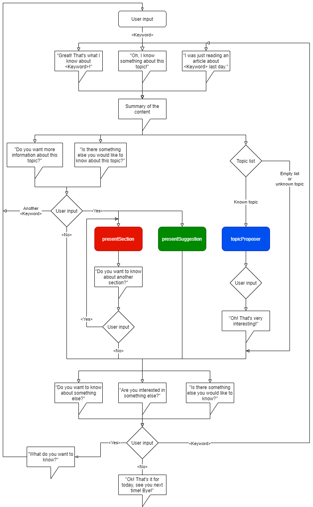

# Social Robotics
This project aims to implement a chat bot able to manage the information contained in the wikipedia website and present them to the user in a human-like way.
The bot is able to adopt different behaviours, extract related topics from the discussed information and summarize the available related content.

## Required Packages

Install the [wikimedia API](https://github.com/barrust/mediawiki) with:

``` pip install pymediawiki ``` 

Install the python [meaningCloud API](https://github.com/MeaningCloud/meaningcloud-python) with:

``` pip install MeaningCloud-python ``` 

## Running the chat bot

To launch the chat bot, run the ``` chatBot.py``` python script.

## Workflow




## Authors
* Francesca Canale: francesca.canale.95@gmail.com
* Tommaso Gruppi: tommygruppi@gmail.com
* Alberto Ghiotto: alberto.ghiotto@hotmail.it
